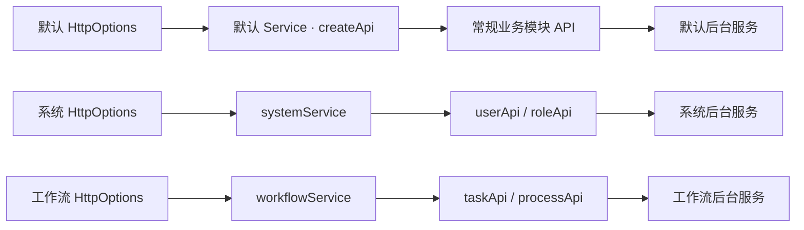

# api-datamodel

面向业务资源组织前端接口的 TypeScript 请求模型。

`api-datamodel` 不绑定具体请求库，而是在 Axios、UniApp 等请求适配器之上，通过 Http 和 Service 统一业务路径、返回数据、加载状态、消息提示和请求取消。Resource 在 Http 上补充上传、下载等可复用请求能力。项目还提供 API Codegen，可根据 Swagger/OpenAPI 文档生成可调用、可维护、具备类型提示的业务模块 API 实例。

## 核心价值

- **按业务建模，而不是散落 URL**：用 `userApi`、`orderApi` 等稳定对象承载一个业务资源的全部操作。
- **默认 Service 即可覆盖常规项目**：配置一个 Service，所有业务模块都从它创建 API 实例。
- **复杂项目按服务域隔离**：不同后台服务可分别配置地址、鉴权、请求头和返回数据规则，再创建各自的业务模块 API。
- **API Codegen**：根据 Swagger/OpenAPI 文档生成请求代码、数据类型和统一导出文件，减少重复手写和前后端偏差。
- **请求实现可替换**：核心只依赖请求适配器，可接入 Axios、UniApp、Taro 或自定义实现。
- **横切能力统一治理**：在一个位置处理服务地址、鉴权、返回结构、Loading、消息提示和异常。
- **能力按需组合**：可单独使用 `Http`，也可组合业务资源和代码生成。

## 业务模式

`api-datamodel` 的公开业务入口是 `createService()`，它等价于 `Resource.createService()`。Http 提供底层静态实现，Resource 在此基础上补充上传、下载等通用能力。

> HttpOptions 定义请求规则，Resource 提供通用请求能力，Service 负责按业务路径创建 API 实例。

大多数项目只需要一个默认 Service：

```text
HttpOptions → Service（createApi）→ userApi / orderApi / roleApi
```

当复杂项目同时连接多个后台服务时，再按照服务域分别创建 Service：

```text
系统 HttpOptions   → systemService   → userApi / roleApi
工作流 HttpOptions → workflowService → taskApi / processApi
文件 HttpOptions   → fileService     → fileApi
```

每个 Service 可以拥有独立的 `serverUrl`、`rootPath`、鉴权逻辑、默认请求参数和返回数据转换；它创建的业务模块 API 实例自动使用这些规则。

对应的代码层次如下：

| 层次 | 作用 | 示例 |
| --- | --- | --- |
| 请求适配器 | 真正发送网络请求 | `axios`、`buildAdapter(uni)` |
| HttpOptions | 描述地址、鉴权和返回规则 | `defaultHttpOptions` |
| Service | 固定后台服务边界并创建 API | `service.createApi` |
| 业务模块 API 实例 | 聚合同一业务模块的全部操作 | `userApi.list()`、`userApi.save()` |



推荐将目录按职责拆分：

```text
src/api/
├─ dataModel.ts          # HttpOptions 与 Service
├─ sys/                  # API Codegen 生成的系统管理接口
│  ├─ Users.ts
│  └─ index.ts
└─ workflow/             # API Codegen 生成的工作流接口
```

## 安装

```bash
pnpm add api-datamodel
```

也可使用 npm 或 yarn：

```bash
npm install api-datamodel
yarn add api-datamodel
```

## 快速开始

### 1. 创建默认 Service

创建 `src/api/dataModel.ts`：

```ts
import { createService, defineConfig, fetchAdapter, setRequestHooks } from 'api-datamodel'

setRequestHooks({
  showLoading() {
    // 打开全局 Loading
  },
  interceptError(error, { abortAll }) {
    if (error.code === '1401') abortAll()
  },
  complete({ errors, successes }) {
    // 关闭 Loading，并集中处理本批请求的消息
  },
})

export const defaultHttpOptions = defineConfig({
  // 任何接收 RequestConfig 并返回 Promise 的函数都可作为适配器。
  adapter: fetchAdapter,
  serverUrl: '/api',
  rootPath: '',
  defRequestConfig: {
    timeout: 30_000,
    headers: { 'content-type': 'application/json' },
  },
  requestInterceptors(config) {
    // 可在这里统一注入 token、租户、区域等信息。
    return config
  },
  transformResponse(result) {
    const { code, msg, data } = result
    return {
      code,
      message: msg === 'SUCCESS' ? '' : msg,
      data,
      success: code === 0 || code === 200,
    }
  },
})

export const service = createService(defaultHttpOptions)
export default service
export const createApi = service.createApi
```

`transformResponse` 应返回 `{ code, message, data, success }`。其中 `success` 决定请求进入成功还是失败分支，成功时业务方法直接得到 `data`。

### 2. 定义业务资源

```ts
import { createApi } from './dataModel'

interface User {
  id: number
  name: string
}

interface UserQuery {
  keyword?: string
  page: number
}

interface Page<T> {
  records: T[]
  total: number
}

// userApi 是由默认 Service 创建的“用户”业务模块 API 实例。
export const userApi = createApi('user', {
  list(query: UserQuery, config?: RequestConfig) {
    return this.$http.get<Page<User>>('page', query, config)
  },

  getInfo(id: number, config?: RequestConfig) {
    return this.$http.get<User>(`${id}`, undefined, config)
  },

  save(user: Partial<User>) {
    return this.$http.post<number>('save', user).then((id) => {
      this.$http.setMessage('用户保存成功')
      return id
    })
  },

  // 业务方法名与 delete、get、post、request 等底层方法重名时，
  // 通过只读的 $http 调用底层请求，避免递归调用自己。
  delete(id: number, config?: RequestConfig) {
    return this.$http.delete<boolean>(`delete/${id}`, undefined, config)
  },
})
```

通过 `service.createApi()` 创建的业务 API 对象只包含业务扩展方法，其原型层仅公开指向独立 Resource 请求实例的只读 `$http` 属性。不同 API 不共享请求实例，但使用所属 Service 动态 Resource 类型上的同一份静态配置。

`$http` 可直接调用以下底层方法：

| 方法 | 用途 |
| --- | --- |
| `$http.request()` | 发起自定义请求 |
| `$http.get()`、`$http.post()`、`$http.put()`、`$http.delete()` | 发起对应 HTTP 请求 |
| `$http.upload()`、`$http.downloadFile()` | `Resource` 提供的上传和下载请求 |
| `$http.setMessage()` | 为当前请求批次增加手动成功消息 |

在资源扩展方法内部使用 `this.$http`，在业务代码中使用 `userApi.$http`。当扩展方法覆盖了 `get`、`post`、`put`、`delete`、`request`、`upload` 或 `downloadFile` 等同名方法时，必须通过 `$http` 调用底层方法：

```ts
export const userApi = createApi('user', {
  request(id: number, config?: RequestConfig) {
    return this.$http.get<User>(`${id}`, undefined, config)
  },
})

// 业务代码中也可以直接使用底层实例；这里仍然继承 user 资源路径。
const user = await userApi.$http.get<User>('1001')

// $http 是只读属性，不能替换为另一个请求实例。
```

按照上面的配置，路径组合如下：

```text
serverUrl  /api
rootPath   空
modulePath user
requestPath page
最终地址   /api/user/page
```

`serverUrl`、`rootPath`、模块路径和请求路径都会统一规范化后拼接。建议各业务路径段不带前后 `/`。

### 3. 在业务代码中调用

```ts
const page = await userApi.$http.get<Page<User>>('page', { page: 1 })
const user = await userApi.$http.get<User>('1001')

// 单请求取消使用标准 AbortSignal。
const controller = new AbortController()
userApi.$http.get<User>('1002', undefined, { signal: controller.signal })
controller.abort('页面已离开')
```

默认模式下，项目只需维护 `defaultHttpOptions` 和 `createApi`。所有业务模块 API 实例共享同一套服务地址、鉴权、拦截器和返回数据规则。

## 多服务域 Service

只有当项目涉及不同后台服务，或者不同服务需要独立的地址、鉴权和返回规则时，才需要创建多个 Service。

例如系统服务与工作流服务分别使用不同代理地址和鉴权头：

```ts
import { createService, defineConfig } from 'api-datamodel'
import axios from 'axios'
import { defaultHttpOptions } from './dataModel'

const systemHttpOptions = defineConfig({
  ...defaultHttpOptions,
  serverUrl: '/system-api',
  requestInterceptors(config) {
    config.headers = {
      ...config.headers,
      Authorization: `Bearer ${getSystemToken()}`,
    }
    return config
  },
})

const workflowHttpOptions = defineConfig({
  adapter: axios,
  serverUrl: '/workflow-api',
  defRequestConfig: {
    timeout: 60_000,
  },
  requestInterceptors(config) {
    config.headers = {
      ...config.headers,
      'X-Workflow-Token': getWorkflowToken(),
    }
    return config
  },
  transformResponse(result) {
    return {
      code: result.status,
      message: result.message,
      data: result.result,
      success: result.status === 200,
    }
  },
})

// 每个 Service 都持有独立配置；with() 通过浅合并创建派生 Service。
export const systemService = createService(systemHttpOptions)
export const workflowService = createService(workflowHttpOptions)
export const systemV2Service = systemService.with({ rootPath: 'v2' })
```

各 Service 创建对应的业务模块 API 实例：

```ts
export const userApi = systemService.createApi('user', {
  list(query: UserQuery) {
    return this.$http.get<User[]>('list', query)
  },
})

export const taskApi = workflowService.createApi('task', {
  pending() {
    return this.$http.get<Task[]>('pending')
  },
})
```

```text
systemService   + user + list    → /system-api/user/list
workflowService + task + pending → /workflow-api/task/pending
```

业务页面最终只依赖 `userApi`、`taskApi` 等模块实例，不需要关心它们来自哪个后台地址或使用哪套鉴权规则。

## API Codegen

API Codegen 根据 Swagger/OpenAPI 文档生成请求代码和数据类型，并创建业务资源和目录下的 `index.ts`。生成文件应视为后端文档的投影，不建议直接修改；业务补充逻辑可放在独立文件中组合或覆盖。

### 后端 Swagger 编写规范

当前内置模板会把 Swagger/OpenAPI 路由转换为 Resource 上的业务方法。为了让生成结果稳定、可读，后端文档建议遵循以下规则。

#### 路径与模块

路径的第一个非空段会作为资源前缀，并从接口的相对路径中移除：

```text
/user/list       → createApi('user', { listUsers() { ... } })
/user/{id}       → createApi('user', { getUser(id) { ... } })
```

生成的资源路径为 `service.rootPath + 第一个路径段`，相对接口路径为去掉第一个路径段后的部分。因此：

- `paths` 中只写服务内的接口路径，不要把完整域名或服务地址写进路径。
- 同一业务模块的接口应使用相同的第一个路径段，例如统一使用 `/user/...`。
- `service.rootPath` 默认按 `gateway` 处理，由派生 Service 统一补充网关前缀。
- 当 `service.rootPathSource` 为 `document` 时，生成器会从 Swagger 路径开头去掉完整的 `rootPath`，或能匹配的最长尾部路径。例如 `rootPath: 'api/v1'` 可处理以 `/api/v1` 或 `/v1` 开头的文档路径。
- `tags[0]` 会参与接口模块分组；建议让第一个 Tag 与路径的第一个段表达同一个业务域。
- 如果多个接口模块的路径前缀发生冲突，模板会追加后续路径段生成唯一的 API 变量名，因此路径段应保持稳定、可区分。

以 Springdoc 注解为例，Controller 的类级路径应直接对应资源模块，Tag 和路径首段保持一致：

```java
@Tag(name = "User")
@RestController
@RequestMapping("/user")
public class UserController {
  @Operation(summary = "查询用户", operationId = "getUser")
  @GetMapping("/{id}")
  public AjaxResult<UserVO> getUser(@PathVariable Long id) {
    // ...
  }
}
```

这会形成 `/user/{id}`，前端生成 `userApi`，并把 `{id}` 生成方法参数。使用网关前缀时，Swagger 不要重复写入该前缀；如果 Swagger 本身已经包含前缀，则将 `service.rootPathSource` 设为 `document`。

#### 操作名与参数

| Swagger 字段 | 生成结果 | 编写要求 |
| --- | --- | --- |
| `operationId` | 业务 API 方法名 | 必填、唯一，使用合法且有业务含义的 TypeScript 方法名 |
| `in: path` | 方法的独立位置参数 | 参数名必须与路径中的 `{id}` 一致，并设置 `required: true` |
| `in: query` | 一个查询对象参数 | 查询参数使用明确的类型和 `required` 定义 |
| `requestBody` | 方法的请求体参数 | 优先使用 `components.schemas` 中的 `$ref`，并正确设置 `required` |
| `in: header` | 不会自动生成业务方法参数 | 鉴权和公共请求头应配置在 Resource、拦截器或 `RequestConfig` 中 |

例如：

```yaml
paths:
  /user/{id}:
    get:
      tags: [User]
      operationId: getUser
      parameters:
        - name: id
          in: path
          required: true
          schema:
            type: integer
      responses:
        '200':
          description: 成功
          content:
            application/json:
              schema:
                $ref: '#/components/schemas/User'

  /user/save:
    post:
      tags: [User]
      operationId: saveUser
      requestBody:
        required: true
        content:
          application/json:
            schema:
              $ref: '#/components/schemas/SaveUserRequest'
      responses:
        '200':
          description: 成功
          content:
            application/json:
              schema:
                type: boolean
```

上面的文档会生成类似以下代码：

```ts
export const userApi = createApi('user', {
  getUser(id: number, config?: RequestConfig) {
    return this.$http.get<User>(`/${id}`, undefined, config)
  },

  saveUser(payload: SaveUserRequest, config?: RequestConfig) {
    return this.$http.post<boolean>('/save', payload, config)
  },
})
```

#### 请求和返回值

- `GET`、`POST`、`PUT`、`DELETE` 会分别生成 `$http.get`、`$http.post`、`$http.put`、`$http.delete`；`PATCH`、`HEAD`、`OPTIONS` 等没有快捷方法的请求统一生成 `$http.request`，并在配置中写入实际 HTTP 方法。
- 成功响应中的 Schema 会成为 `$http` 方法的 TypeScript 泛型；`components.schemas` 中的对象、枚举和数组会生成到 `data-contracts.ts`。
- 如果响应模型名称以 `responseSchema.namePrefix` 开头（默认是 `AjaxResult`），并且包含 `responseSchema.dataField` 字段，模板会将业务方法的返回类型展开为该字段的类型。建议统一使用类似 `AjaxResultUser`、`AjaxResultUserList` 的具体响应模型。
- 请求体模型的字段全部可选时，生成的方法会把请求体默认成 `{}`；必须提交请求体的接口应在 `requestBody.required` 或字段 `required` 中准确声明。
- 当前模板会把解析为 `void` 的成功响应统一生成 `$http.downloadFile`。因此普通删除或更新接口不要只定义无响应体的 `204`，否则可能被当成文件下载接口；普通业务接口应返回明确的 JSON Schema。
- `multipart/form-data` 不会自动转换为 `$http.upload`，文件上传接口需要在业务层使用 `$http.upload`，或另行提供自定义模板。

接口的 `summary`、`description`、请求方法和路径会写入生成方法的 JSDoc；响应 Schema 主要负责类型生成，实际的鉴权、服务地址和统一返回值处理由 Service 配置负责。

#### `responseSchema` 响应模型规范

项目运行时的统一响应处理约定为 `{ success, code, message, data }`。后端接口应让成功响应的 OpenAPI Schema 明确描述 `data` 的实际类型，并为不同的 `data` 类型生成稳定的 Schema 名称：

```yaml
components:
  schemas:
    AjaxResultUser:
      type: object
      properties:
        success:
          type: boolean
        code:
          type: integer
        message:
          type: string
        data:
          $ref: '#/components/schemas/UserVO'
```

对应的注解应明确声明具体响应模型，而不是只声明一个没有泛型信息的 `AjaxResult`：

```java
@Operation(summary = "查询用户", operationId = "getUser")
@ApiResponse(
    responseCode = "200",
    content = @Content(
        mediaType = "application/json",
        schema = @Schema(implementation = AjaxResultUser.class)
    )
)
```

模板识别到以 `AjaxResult` 开头且包含 `data` 字段的响应模型时，会把生成方法的返回泛型展开为 `data` 类型：

```ts
getUser(id: number, config?: RequestConfig): Promise<UserVO>
```

因此建议遵循以下约定：

- 响应模型命名使用 `AjaxResult` + 业务类型，例如 `AjaxResultUser`、`AjaxResultUserList`、`AjaxResultBoolean`。
- 如果后端使用通用 `AjaxResult<T>`，应通过 `@Schema(name = "AjaxResultUser")` 或框架等价配置，让最终 `components.schemas` 中的具体模型名称仍以 `AjaxResult` 开头。
- `data` 字段必须有明确的 `$ref`、数组或基础类型 Schema，不要只声明为空对象。
- 普通删除、启用、停用接口也建议返回 `AjaxResultBoolean`，避免只有 `204` 无响应体而被模板识别为下载接口。
- `success`、`code`、`message`、`data` 的字段名应保持一致；Resource 的 `transformResponse` 会据此提取 `data`。

#### `downloadFile` 响应规范

当前 `procedure-call.ejs` 的判断是：成功响应被解析为 `void` 时，生成 `$http.downloadFile`，而不是普通的 `$http.get` 或 `$http.post`。因此文件下载接口应明确使用“服务端写入二进制响应、Swagger 不声明 JSON 响应体”的约定：

```java
@Operation(summary = "导出用户", operationId = "exportUsers")
@ApiResponse(responseCode = "200", description = "文件流")
@GetMapping("/export")
public void exportUsers(HttpServletResponse response) {
  // 设置 Content-Type、Content-Disposition，并将文件写入 response
}
```

生成结果类似：

```ts
exportUsers(config?: RequestConfig) {
  return this.$http.downloadFile('/export', { method: 'GET', ...config })
}
```

下载接口还应在实际 HTTP 响应中设置 `Content-Disposition`，这样 `downloadFile` 才能解析文件名。反之，普通业务接口不要使用“无响应体”的写法来表示成功；应声明 `AjaxResult<T>` 或其他明确的 JSON Schema，否则同样会生成 `downloadFile`。

### 业务项目配置

推荐在业务项目根目录创建 `api-datamodel.config.ts`，CLI 会自动发现并加载该文件：

```ts
import defineConfig from 'api-datamodel/codegen/defineConfig.js'

export default defineConfig({
  // 所有接口共用的配置。
  outputDir: 'src/api',
  service: {
    // 每个输出目录都会生成 resource.ts；路径和名称共同定位已配置的 Service。
    importPath: '@/api/dataModel',
    importName: 'service',
    rootPath: 'system',
    rootPathSource: 'gateway',
  },
  responseSchema: {
    namePrefix: 'AjaxResult',
    dataField: 'data',
  },
  documentRequest: {
    timeout: 30_000,
    // headers: { Authorization: 'Bearer ...' },
  },
  // strip：去除自动序号并打印错误；keep-suffix：保留序号；error：终止生成。
  duplicateMethodStrategy: 'strip',
  generatorOptions: {
    cleanOutput: true,
    modular: true,
    routeTypes: true,
  },

  // 每项代表一个可独立生成的后端文档或业务域。
  apis: {
    sys: {
      label: '系统管理',
      url: 'http://127.0.0.1:8080/v3/api-docs/系统管理',
      outputFolder: 'sys',
    },
  },
})
```

`defineConfig` 原样返回配置对象，并提供 TypeScript 类型提示。

生成器通过两个独立字段指定已经配置完成的 Service：`service.importPath` 是模块路径，`service.importName` 是该模块导出的 Service 名称。

- 没有 `rootPath` 时，生成的 `resource.ts` 直接导出 `service.createApi`。
- 存在 `rootPath` 时，生成器导出 `service.with({ rootPath }).createApi`，不会修改原 Service。
- 最终合并配置中 `service.importPath` 和 `service.importName` 都是必填项；Service 已负责 adapter、服务地址、鉴权和返回转换，codegen 只负责按需派生 `rootPath`。

多服务域示例：

```js
apis: {
  sys: {
    url: 'http://127.0.0.1:8080/v3/api-docs/系统管理',
    service: {
      importPath: '@/api/services',
      importName: 'systemService',
      rootPath: 'system',
      rootPathSource: 'gateway',
    },
    outputFolder: 'sys',
  },
}
```

### 配置项

| 配置项 | 位置 | 默认值 | 说明 |
| --- | --- | --- | --- |
| `outputDir` | 全局或单接口 | `src/api` | 生成根目录 |
| `service` | 全局或单接口 | `rootPathSource: 'gateway'` | Service 模块路径、导出名称、派生 `rootPath` 及其来源 |
| `responseSchema` | 全局或单接口 | `AjaxResult` + `data` | 响应模型包装规则；配置 `namePrefix` 和 `dataField` |
| `url` | 单接口 | 无 | Swagger/OpenAPI 远程地址或本地 JSON/YAML 文件路径 |
| `outputFolder` | 单接口 | 当前配置名称 | 输出子目录 |
| `label` | 单接口 | 配置名称 | 交互选择时显示的名称 |
| `generatorOptions` | 全局或单接口 | 内置推荐配置 | 传递给 `swagger-typescript-api` 的其他选项 |
| `documentRequest` | 全局或单接口 | `timeout: 30000` | 远程文档请求的超时和请求头 |
| `duplicateMethodStrategy` | 全局或单接口 | `strip` | 重名方法处理方式：`strip`、`keep-suffix` 或 `error` |

单接口配置会覆盖全局配置。

`duplicateMethodStrategy` 的行为：

- `strip`：去除 `swagger-typescript-api` 自动追加的数字后缀，打印“接口命名冲突”错误，但继续生成代码。
- `keep-suffix`：发生冲突时保留自动追加的数字后缀，打印警告并继续生成，确保方法名仍然唯一。
- `error`：发现冲突立即终止生成；由于正式目录只在生成全部成功后替换，因此原输出代码不会改变。

默认按顺序查找以下文件：

1. `api-datamodel.config.ts`
2. `api-datamodel.config.mts`
3. `api-datamodel.config.mjs`
4. `api-datamodel.config.js`
5. `api-datamodel.config.cts`
6. `api-datamodel.config.cjs`
7. `api-datamodel.config.json`

配置文件也可以导出返回配置对象的同步或异步函数。对于未声明 `"type": "module"` 的项目，推荐使用 `.mjs`，或者在 `.cjs` 中使用 `module.exports`。

### 加入 package.json 命令

```json
{
  "scripts": {
    "genApi": "api-datamodel-codegen",
    "genApi:sys": "api-datamodel-codegen sys"
  }
}
```

```bash
# 读取 apis.sys
pnpm genApi:sys

# 不指定名称时，从所有配置中交互选择
pnpm genApi
```

指定非默认配置文件：

```bash
api-datamodel-codegen --config ./config/api.mjs sys
```

也可直接传入位置参数：

```bash
npx api-datamodel-codegen <文档地址> <输出文件夹>
npx api-datamodel-codegen ./openapi.yaml --output local
```

生成过程先写入同级临时目录，全部成功后才替换正式输出目录；文档、模板或生成过程出错时会保留原有代码。

查看完整命令帮助：

```bash
npx api-datamodel-codegen --help
```

## 请求配置与运行时能力

### 单次请求配置

```ts
await userApi.list(
  { page: 1 },
  {
    silent: true,
    timeout: 10_000,
    signal: controller.signal,
  },
)
```

常用扩展字段：

| 字段 | 作用 |
| --- | --- |
| `silent` | 不参与 Loading 和消息聚合，但仍进入错误拦截和全局活动请求登记 |
| `messageMode` | 错误提示模式：`none`、`message` 或 `modal` |
| `signal` | 使用标准 `AbortSignal` 取消单个请求 |
| `rawResponse` | 直接返回适配器原始响应，跳过返回数据转换和业务拦截 |

未配置 `rawResponse` 时，非 JSON 的 `responseType` 默认返回适配器原始响应；显式设为 `false` 可强制执行响应处理。

### Loading 和消息

普通请求在持续超过 200ms 后才显示 Loading，避免短请求造成闪烁；同批并发请求全部结束后统一关闭。

```ts
import { setRequestHooks } from 'api-datamodel'

setRequestHooks({
  showLoading() {
    // 打开全局 Loading
  },
  interceptError(error, { abortAll }) {
    // 系统错误收到后立即执行；所有取消都不会进入这里。
    if (error.code === '1401') abortAll()
  },
  complete({ errors, successes }) {
    // 关闭 Loading，并集中处理本批请求的消息
  },
})
```

业务方法可在请求回调中用 `$http.setMessage` 替换后端消息：

```ts
save(data: UserInput) {
  return this.$http.post('save', data).then((result) => {
    this.$http.setMessage('保存成功')
    return result
  })
}
```

第一次设置手动成功消息时，会清除本批次已经收集的后端成功消息；后续后端成功消息会被忽略。错误消息不受影响。空消息会被忽略：

```ts
await userApi.save(data).then((result) => {
  userApi.$http.setMessage('')
  return result
})
```

### 请求取消

```ts
const controller = new AbortController()
const request = userApi.$http.get<User>('1001', undefined, { signal: controller.signal })

controller.abort('用户取消')
await request
```

所有形式的取消都不会进入 `interceptError`，也不会进入批次消息。全局中止仅通过 `interceptError` 的 `abortAll()` 上下文提供。

## 文件上传、下载和跨平台适配

### Web 文件上传与下载

```ts
import { Resource } from 'api-datamodel'

const fileApi = Resource.createService(defaultHttpOptions).createApi('file', {})
const formData = new FormData()
formData.append('file', file)

await fileApi.$http.upload('avatar', formData)

const { filename, data } = await fileApi.$http.downloadFile('export')
```

`downloadFile` 默认从 `Content-Disposition` 解析普通文件名和 RFC 5987 编码文件名，返回 `{ filename, data }`。

### UniApp/Taro 类平台

`buildAdapter` 将平台的 `request`、`uploadFile` 和 `downloadFile` 统一为请求适配器：

```ts
import { buildAdapter, Resource } from 'api-datamodel'

export const service = Resource.createService({
  adapter: buildAdapter(uni),
  serverUrl: 'https://example.com/api',
})
export const createApi = service.createApi
```

跨平台上传参数：

```ts
await userApi.$http.upload('avatar', {
  filePath: tempFilePath,
  fileKey: 'file',
  userId: 1001,
})
```

外部 `AbortSignal` 会同步调用平台请求任务的 `abort()`。

## 公共 API

| 导出 | 作用 |
| --- | --- |
| `Http` | 标准请求类；提供请求方法和静态 `createService()` |
| `Resource` | 单纯在 `Http` 上增加 `upload`、`downloadFile`，并继承静态 `createService()` |
| `createService` | `Resource.createService()` 的顶层等价入口 |
| `setRequestHooks` | 配置全局 `showLoading`、`interceptError` 和 `complete` 请求生命周期 Hook |
| 业务 API 实例的 `$http` | 原型层提供的只读属性，指向独立 Http/Resource 请求实例，用于调用底层请求能力 |
| `defineConfig` | 为请求配置提供 TypeScript 类型约束 |
| `api-datamodel/codegen/defineConfig.js` | API Codegen 配置的 `defineConfig` 默认导出 |
| `buildAdapter` | 适配 UniApp/Taro 类跨平台请求 API |
| `fetchAdapter` | 将浏览器或 Node.js 18+ 的标准 Fetch API 包装为请求适配器 |

## 使用约束

- 资源扩展对象中的函数会绑定到资源实例，其他属性按原值保留。
- 业务方法覆盖 `get`、`post`、`delete`、`request` 等名称时，必须通过 `this.$http` 调用底层请求。
- API Codegen 开启 `cleanOutput` 后会清理对应输出目录，请勿在生成目录手写业务文件。
- `transformResponse` 应明确返回 `success`，否则无法可靠判断业务成功状态。
- `setRequestHooks` 是可选的全局配置；没有 UI 和系统错误处理需求时无需设置。
- 路径会按 `serverUrl + rootPath + modulePath + requestPath` 统一规范化，建议各业务路径段不带前后 `/`。
