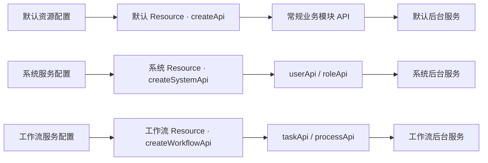

# api-datamodel

面向业务资源组织前端接口的 TypeScript 请求模型。

`api-datamodel` 不绑定具体请求库，而是在 Axios、UniApp 等请求适配器之上，通过 Resource 统一业务路径、返回数据、加载状态、消息提示、请求取消和查询缓存。常规项目使用一个默认 Resource；涉及多个后台服务时，再按服务域分别配置地址、鉴权和数据规则。项目还提供 Swagger/OpenAPI 生成器，可将后端文档直接转换为可调用、可维护、具备类型提示的业务模块 API 实例。

## 核心价值

- **按业务建模，而不是散落 URL**：用 `userApi`、`orderApi` 等稳定对象承载一个业务资源的全部操作。
- **默认资源即可覆盖常规项目**：配置一次默认 Resource，所有业务模块都从它创建 API 实例。
- **复杂项目按服务域隔离**：不同后台服务可分别配置地址、鉴权、请求头和返回数据规则，再创建各自的业务模块 API。
- **接口文档直接生成业务代码**：从 Swagger/OpenAPI 生成类型、资源方法和统一导出文件，减少重复手写和前后端偏差。
- **请求实现可替换**：核心只依赖请求适配器，可接入 Axios、UniApp、Taro 或自定义实现。
- **横切能力统一治理**：在一个位置处理服务地址、鉴权、返回结构、Loading、消息提示和异常。
- **查询结果可复用**：同一方法和参数只创建一份缓存，并可派生记录映射或字典映射。
- **能力按需组合**：可单独使用 `Http`，也可组合业务资源、代码生成和缓存。

## 业务模式

`api-datamodel` 的核心是 `Resource`。业务代码不直接管理请求地址，而是先配置资源，再由资源创建业务模块 API 实例。

> 资源配置定义请求规则，服务域 Resource 承载这些规则，再由 Resource 创建业务模块 API 实例对象。默认资源优先，多个服务域按需创建。

大多数项目只需要一个默认资源：

```text
默认资源配置 → 默认 Resource（createApi）→ userApi / orderApi / roleApi
```

当复杂项目同时连接多个后台服务时，再按照服务域分别创建 Resource：

```text
系统服务配置   → 系统 Resource（createSystemApi）     → userApi / roleApi
工作流服务配置 → 工作流 Resource（createWorkflowApi） → taskApi / processApi
文件服务配置   → 文件 Resource（createFileApi）       → fileApi
```

每个服务域 Resource 可以拥有独立的 `serverUrl`、`rootPath`、鉴权逻辑、默认请求参数和返回数据转换；它创建的业务模块 API 实例自动继承这些规则。

对应的代码层次如下：

| 层次 | 作用 | 示例 |
| --- | --- | --- |
| 请求适配器 | 真正发送网络请求 | `axios`、`buildAdapter(uni)` |
| 默认资源配置 | 常规项目共享的地址、鉴权和返回规则 | `defaultResourceConfig` |
| 服务域 Resource | 固定某个后台服务的请求边界 | `createApi`、`createSystemApi` |
| 业务模块 API 实例 | 聚合同一业务模块的全部操作 | `userApi.list()`、`userApi.save()` |
| 缓存视图 | 复用查询结果并生成映射 | `userCache.getMap()` |



推荐将目录按职责拆分：

```text
src/api/
├─ dataModel.ts          # 默认资源配置与服务域 Resource 工厂
├─ sys/                  # Swagger 生成的系统管理接口
│  ├─ Users.ts
│  └─ index.ts
├─ workflow/             # Swagger 生成的工作流接口
└─ cache/                # 面向页面或 Store 的缓存封装
```

## 安装

```bash
pnpm add api-datamodel
```

也可使用 npm 或 yarn：

```bash
npm install api-datamodel
yarn add api-datamodel
```

## 快速开始

### 1. 创建默认资源

创建 `src/api/dataModel.ts`：

```ts
import axios from 'axios'
import { defineConfig, serviceInit, setLoadingServe } from 'api-datamodel'

// 非 silent 请求需要初始化 Loading 服务。
// 可接入任意 UI 框架；暂不需要界面反馈时可使用空实现。
setLoadingServe({
  show() {},
  close() {},
})

export const defaultResourceConfig = defineConfig({
  // 任何接收 RequestConfig 并返回 Promise 的函数都可作为适配器。
  adapter: axios,
  serverUrl: '/api',
  rootPath: '',
  defRequestConfig: {
    timeout: 30_000,
    headers: { 'content-type': 'application/json' },
  },
  requestInterceptors(config) {
    // 可在这里统一注入 token、租户、区域等信息。
    return config
  },
  transformResponse(result) {
    const { code, msg, data } = result
    return {
      code,
      message: msg === 'SUCCESS' ? '' : msg,
      data,
      success: code === 0 || code === 200,
    }
  },
})

// 初始化默认资源，并获得业务模块 API 创建方法。
export const createApi = serviceInit(defaultResourceConfig)
```

`transformResponse` 应返回 `{ code, message, data, success }`。其中 `success` 决定请求进入成功还是失败分支，成功时业务方法直接得到 `data`。

### 2. 定义业务资源

```ts
import { createApi } from './dataModel'

interface User {
  id: number
  name: string
}

interface UserQuery {
  keyword?: string
  page: number
}

interface Page<T> {
  records: T[]
  total: number
}

// userApi 是由默认 Resource 创建的“用户”业务模块 API 实例。
export const userApi = createApi('user', {
  list(query: UserQuery, config?: RequestConfig) {
    return this.get<Page<User>>('page', query, config)
  },

  getInfo(id: number, config?: RequestConfig) {
    return this.get<User>(`${id}`, undefined, config)
  },

  save(user: Partial<User>) {
    return this.post<number>('save', user).then((id) => {
      this.setMessage('用户保存成功')
      return id
    })
  },

  // 业务方法名与 delete、get、post、request 等底层方法重名时，
  // 通过只读的 $http 调用底层请求，避免递归调用自己。
  delete(id: number) {
    return this.$http.delete<boolean>(`${id}`)
  },
})
```

按照上面的配置，路径组合如下：

```text
serverUrl  /api
rootPath   空
resource   user
operation  page
最终地址   /api/user/page
```

资源名以 `/` 开头时会绕过 `rootPath`。需要继承业务域前缀时，应使用 `user`，不要使用 `/user`。

### 3. 在业务代码中调用

```ts
const page = await userApi.list({ page: 1 })
const user = await userApi.getInfo(1001)

// 取消该资源当前所有进行中的请求。
userApi.$http.abort('页面已离开')
```

默认模式下，项目只需维护 `defaultResourceConfig` 和 `createApi`。所有业务模块 API 实例共享同一套服务地址、鉴权、拦截器和返回数据规则。

## 多服务域资源

只有当项目涉及不同后台服务，或者不同服务需要独立的地址、鉴权和返回规则时，才需要创建多个服务域 Resource。

例如系统服务与工作流服务分别使用不同代理地址和鉴权头：

```ts
import { ApiResource, defineConfig } from 'api-datamodel'
import axios from 'axios'
import { defaultResourceConfig } from './dataModel'

const systemResourceConfig = defineConfig({
  ...defaultResourceConfig,
  serverUrl: '/system-api',
  requestInterceptors(config) {
    config.headers = {
      ...config.headers,
      Authorization: `Bearer ${getSystemToken()}`,
    }
    return config
  },
})

const workflowResourceConfig = defineConfig({
  adapter: axios,
  serverUrl: '/workflow-api',
  defRequestConfig: {
    timeout: 60_000,
  },
  requestInterceptors(config) {
    config.headers = {
      ...config.headers,
      'X-Workflow-Token': getWorkflowToken(),
    }
    return config
  },
  transformResponse(result) {
    return {
      code: result.status,
      message: result.message,
      data: result.result,
      success: result.status === 200,
    }
  },
})

// 每个创建方法代表一个配置独立的服务域 Resource。
export const createSystemApi = ApiResource.factory(systemResourceConfig)
export const createWorkflowApi = ApiResource.factory(workflowResourceConfig)
```

服务域 Resource 再创建对应的业务模块 API 实例：

```ts
export const userApi = createSystemApi('user', {
  list(query: UserQuery) {
    return this.get<User[]>('list', query)
  },
})

export const taskApi = createWorkflowApi('task', {
  pending() {
    return this.get<Task[]>('pending')
  },
})
```

```text
createSystemApi   + user   + list     → /system-api/user/list
createWorkflowApi + task   + pending  → /workflow-api/task/pending
```

业务页面最终只依赖 `userApi`、`taskApi` 等模块实例，不需要关心它们来自哪个后台地址或使用哪套鉴权规则。

## 根据 Swagger/OpenAPI 生成接口

生成器会创建业务资源、数据类型和目录下的 `index.ts`。生成文件应视为后端文档的投影，不建议直接修改；业务补充逻辑可放在独立文件中组合或覆盖。

### 业务项目配置

推荐在业务项目根目录创建 `api-datamodel.config.mjs`：

```js
/** @type {import('api-datamodel/swagger/config').ApiDatamodelConfig} */
export default {
  // 所有接口共用的配置。
  output: 'src/api',
  httpPath: '@/api/dataModel',
  httpModule: 'createApi',
  generator: {
    cleanOutput: true,
    modular: true,
    routeTypes: true,
  },

  // 每项代表一个可独立生成的后端文档或业务域。
  apis: {
    sys: {
      description: '系统管理',
      url: 'http://127.0.0.1:8080/v3/api-docs/系统管理',
      folder: 'sys',
      prePath: 'system',
    },
    lowCode: {
      description: '低代码管理',
      url: 'http://127.0.0.1:8080/v3/api-docs/低代码管理',
      folder: 'lowCodeApi',
      template: 'lowcode',
    },
  },
}
```

生成器与 Resource 有两种对应方式：

- 默认资源模式：统一使用 `httpModule: 'createApi'`，需要区分路径时通过 `prePath` 添加服务前缀。
- 多服务域模式：使用 `httpModule` 指向对应的服务域 Resource，例如 `createSystemApi`；服务地址或 `rootPath` 已在 Resource 中配置时，不再重复设置 `prePath`。

多服务域示例：

```js
apis: {
  sys: {
    url: 'http://127.0.0.1:8080/v3/api-docs/系统管理',
    httpModule: 'createSystemApi',
    folder: 'sys',
  },
}
```

### 配置项

| 配置项 | 位置 | 默认值 | 说明 |
| --- | --- | --- | --- |
| `output` | 全局或单接口 | `src/api` | 生成根目录 |
| `httpPath` | 全局或单接口 | `@/api/dataModel` | 业务工厂的导入路径 |
| `httpModule` | 全局或单接口 | `createApi` | 默认或服务域 Resource 的 API 创建方法名称 |
| `url` | 单接口 | 无 | Swagger/OpenAPI JSON 地址 |
| `folder` | 单接口 | 当前配置名称 | 输出子目录 |
| `prePath` | 单接口 | 空 | 添加到生成资源名之前的业务路径 |
| `template` | 全局或单接口 | `modular` | `modular`、`lowcode` 或自定义模板目录 |
| `description` | 单接口 | 配置名称 | 交互选择时显示的名称 |
| `generator` | 全局或单接口 | 内置推荐配置 | 传递给 `swagger-typescript-api` 的其他选项 |

单接口配置会覆盖全局配置；`generator.fileNames` 会进行合并，而不是整体替换。

默认按顺序查找以下文件：

1. `api-datamodel.config.mjs`
2. `api-datamodel.config.js`
3. `api-datamodel.config.cjs`
4. `api-datamodel.config.json`

配置文件也可以导出返回配置对象的同步或异步函数。对于未声明 `"type": "module"` 的项目，推荐使用 `.mjs`，或者在 `.cjs` 中使用 `module.exports`。

### 加入 package.json 命令

```json
{
  "scripts": {
    "genApi": "api-datamodel-swagger",
    "genApi:sys": "api-datamodel-swagger sys",
    "genApi:lowCode": "api-datamodel-swagger lowCode"
  }
}
```

```bash
# 读取 apis.sys
pnpm genApi:sys

# 读取 apis.lowCode
pnpm genApi:lowCode

# 不指定名称时，从所有配置中交互选择
pnpm genApi
```

指定非默认配置文件：

```bash
api-datamodel-swagger --config ./config/api.mjs sys
```

也可直接传入位置参数：

```bash
npx api-datamodel-swagger <文档地址> <输出文件夹> [业务前缀]
```

查看完整命令帮助：

```bash
npx api-datamodel-swagger --help
```

## 请求配置与运行时能力

### 单次请求配置

```ts
await userApi.list(
  { page: 1 },
  {
    silent: true,
    timeout: 10_000,
    signal: controller.signal,
  },
)
```

常用扩展字段：

| 字段 | 作用 |
| --- | --- |
| `silent` | 不显示 Loading，也不显示成功或错误消息 |
| `backendLoad` | 不进入 Loading 队列，但仍可处理消息 |
| `messageMode` | 错误提示模式：`none`、`message` 或 `modal` |
| `signal` | 使用标准 `AbortSignal` 取消单个请求 |
| `IgnoreInterceptor` | 跳过返回数据转换和业务拦截 |

`IgnoreInterceptor` 是当前 API 的实际字段名，首字母必须大写。非 JSON 的 `responseType` 默认会自动跳过业务拦截。

### Loading 和消息

普通请求在持续超过 200ms 后才显示 Loading，避免短请求造成闪烁；同批并发请求全部结束后统一关闭。

```ts
import { setLoadingServe } from 'api-datamodel'

setLoadingServe({
  show() {
    // 打开全局 Loading
  },
  message(message) {
    // 每个请求结束时可选地处理消息
  },
  close(lastMessage, messageList) {
    // 关闭 Loading，并集中处理本批请求的消息
  },
})
```

业务方法可在请求回调中用 `setMessage` 替换后端消息：

```ts
save(data: UserInput) {
  return this.post('save', data).then((result) => {
    this.setMessage('保存成功')
    return result
  })
}
```

在请求回调中传入空字符串可取消当前请求的默认消息：

```ts
await userApi.save(data).then((result) => {
  userApi.setMessage('')
  return result
})
```

### 请求取消

```ts
const controller = new AbortController()
const request = userApi.getInfo(1001, { signal: controller.signal })

controller.abort('用户取消')
await request
```

也可取消某个资源的全部进行中请求：

```ts
userApi.$http.abort('页面已离开')
```

## 查询缓存与字典映射

`createCache` 按调用参数的 JSON 序列化结果建立缓存。同一方法使用相同参数调用时，会返回同一个 `CacheResult`。

### 缓存普通查询

```ts
import { createCache } from 'api-datamodel'

export const getUsers = createCache(userApi.list)

const cache = getUsers({ page: 1 })

// 命令式代码应等待异步结果。
const page = await cache.getResult()

// result 会触发加载并立即返回当前缓存值，首次访问可能为 undefined，
// 更适合放在 Vue 等响应式状态中读取。
const currentPage = cache.result

await cache.reload()
```

### 建立记录映射

普通记录不会自动猜测 `id` 字段。需要映射时必须明确指定 `keyField`：

```ts
const getDepartments = createCache({
  request: deptApi.list,
  keyField: 'deptId',
})

const departments = getDepartments()
const departmentMap = await departments.getMap()

// departmentMap[100] 为完整部门记录。
```

### 建立字典映射

标准 `{ value, label }` 数组可自动转换为 `value -> label` 映射。非标准字段应同时配置 `keyField` 和 `labelField`：

```ts
const getStatuses = createCache({
  request: statusApi.list,
  keyField: 'code',
  labelField: 'name',
})

const statusCache = getStatuses()
const statusMap = await statusCache.getMap()
// statusMap.enabled === '启用'

const options = await statusCache.getResult()
// [{ value: 'enabled', label: '启用', original: 原始记录 }]
```

`CacheResult` 的主要能力：

| 成员 | 说明 |
| --- | --- |
| `getResult()` | 异步取得缓存结果；失败后再次读取会重试 |
| `result` | 返回当前缓存结果，同时触发异步加载 |
| `getMap()` | 异步取得记录或字典映射 |
| `map` | 返回当前映射，同时触发异步构建 |
| `reload()` | 重新请求并刷新结果与映射 |

需要集中管理多个缓存时，可使用 `createCacheStore({}).produce()` 或 `produceBatch()` 为 Store 建立统一缓存空间和转换逻辑。

## 文件上传、下载和跨平台适配

### Web 文件上传与下载

```ts
const formData = new FormData()
formData.append('file', file)

await userApi.upload('avatar', formData)

const { filename, data } = await userApi.downloadFile('export')
```

`downloadFile` 默认从 `Content-Disposition` 解析普通文件名和 RFC 5987 编码文件名，返回 `{ filename, data }`。

### UniApp/Taro 类平台

`buildAdapter` 将平台的 `request`、`uploadFile` 和 `downloadFile` 统一为请求适配器：

```ts
import { ApiResource, buildAdapter } from 'api-datamodel'

export const createApi = ApiResource.factory({
  adapter: buildAdapter(uni),
  serverUrl: 'https://example.com/api',
})
```

跨平台上传参数：

```ts
await userApi.upload('avatar', {
  filePath: tempFilePath,
  fileKey: 'file',
  userId: 1001,
})
```

外部 `AbortSignal` 会同步调用平台请求任务的 `abort()`。

## 公共 API

| 导出 | 作用 |
| --- | --- |
| `Http` | 标准请求类；提供 `request`、`get`、`post`、`put`、`delete`、`abort` 和工厂方法 |
| `ApiResource` | 在 `Http` 上增加 `upload`、`downloadFile` 的业务资源类 |
| `defineConfig` | 为请求配置提供 TypeScript 类型约束 |
| `setGlobalConfig` | 合并全局请求配置 |
| `serviceInit` | 设置全局配置并返回资源工厂 |
| `setLoadingServe` | 接入全局 Loading 和消息服务 |
| `createCache` | 为单个异步方法创建按参数缓存 |
| `CacheResult` | 读取、刷新缓存以及生成映射 |
| `createCacheStore` | 创建共享缓存空间和批量缓存工厂 |
| `registBatch` | 一次注册多个缓存方法 |
| `buildAdapter` | 适配 UniApp/Taro 类跨平台请求 API |

## 使用约束

- 资源扩展项必须是函数，不再支持字符串形式的方法快捷配置。
- 业务方法覆盖 `get`、`post`、`delete`、`request` 等名称时，必须通过 `this.$http` 调用底层请求。
- Swagger 生成器开启 `cleanOutput` 后会清理对应输出目录，请勿在生成目录手写业务文件。
- `transformResponse` 应明确返回 `success`，否则无法可靠判断业务成功状态。
- 非 `silent` 请求需要先调用 `setLoadingServe`；没有 UI 需求时可传入空实现。
- 资源名以 `/` 开头会绕过 `rootPath`，业务域模式下通常不应使用前导斜杠。
